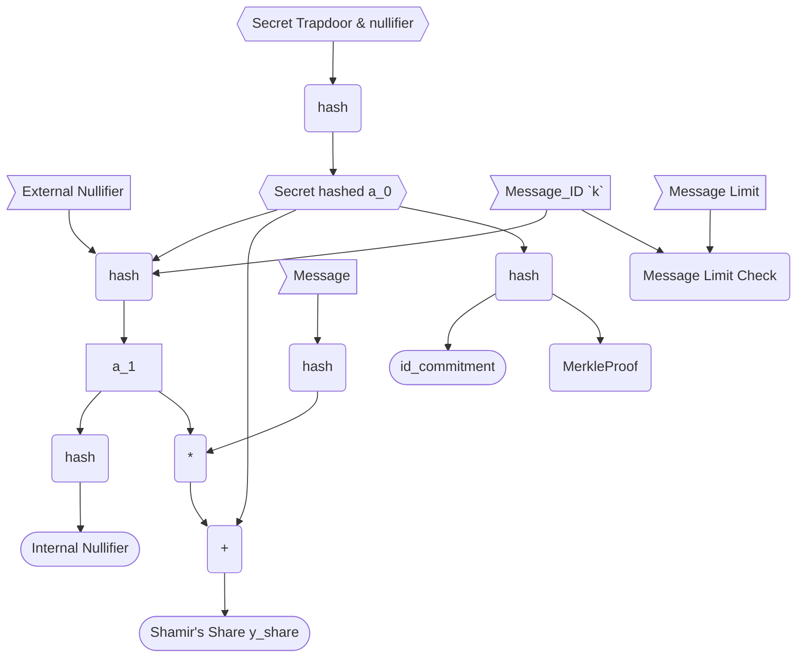

<h1 align=center>Rate-Limit-Nullifier</h1>

    

Read formal description <a href="https://github.com/Rate-Limiting-Nullifier/rln-circuits-v2/blob/main/docs/README.md">here</a>

Read RFC <a href="https://rfc.vac.dev/spec/58/">here</a>

## TL;DR

The main goal of RLN v2 circuits is to make it possible to have a custom amount of messages (signals) per epoch without using a separate circuit or high-degree polynomials for [Shamir's Secret Sharing](https://rate-limiting-nullifier.github.io/rln-docs/sss.html).

## RLN V1

The [Current RLN circuit](https://github.com/Rate-Limiting-Nullifier/rln-circuits/blob/master/circuits/rln-base.circom) uses a first-degree polynomial for shares generation (and slashing). Therefore, there is a limit - one message per epoch. 

There have been attempts to make schemes in which the message limit per epoch is greater than one. For example, [N-RLN scheme](https://hackmd.io/zOk-bQ2GSgaJ1t1bI7zrWQ?view) & [N-RLN Circuits](https://github.com/Rate-Limiting-Nullifier/rln-circuits/blob/master/circuits/nrln-base.circom). But this approach is very problematic; the bigger the epoch limit, the higher the polynomial for Shamir's Secret Sharing, and the more complicated the circuit is(more R1CS, etc.).

We have generally advised using 1 message/signal per epoch and adjusting the epoch length to match the rate limit desired for your use case. However, this isn’t very flexible and constrains the epoch length for all users to be the same per semaphore group (merkle tree).

### Overview of RLN v1 circuits

Before we move on, this is a quick refresher on the inputs/outputs of the RLN v1 circuits and their general purpose. If you want more detail on how RLN circuits work, please [read this](https://rate-limiting-nullifier.github.io/rln-docs/protocol_spec.html), which goes into more detail.

**Inputs**:

Public: 
* `external_nullifier` = `h(rln_identifier, epoch)` - *This identifies a unique epoch per app*, where `rln_identifier` is some unique identifier for an app and `epoch` is some unique identifier for an event or time;
* `x` = `h(message)`.

Private: 
* Secret Key `h(trapdoor, nullifier)` - This is to prove you are in some merkle tree, and to make the `y_share`, and `internal_nullifier` unique to an `id_commitment`.

**Outputs**:

* `Internal_Nullifier`
    * Used to identify a unique user during a specific epoch (external_nullifier)
* `Y_Share`
    * This is the [Shamir's Secret Sharing](https://rate-limiting-nullifier.github.io/rln-docs/sss.html) share

## Update to V2

Instead of using higher degree polynomials to generate coefficients for higher epoch limits, we can add an input to the hash function, which is a counter `k` that ranges from 1 to `n`, the `epoch limit` (which can be `id_commitment` specific, for example in a registry contract.

The scheme would work as follows:

* The user generates a secret `a_0`
* The coefficient `a_1` is generated by taking the hash of `a_0`, an external nullifier, and the counter `k`: h(`a_0`, `external_nullifier`, `k`)
* The `internal_nullifier` is then generated by taking the hash of `a_1`: h(`a_1`)

By adding the counter `k` as an input to the hash function, the scheme becomes more flexible but still simple. It ensures that the user cannot use a value of `k` greater than `n`, which is the epoch limit, and if the user uses the same value of `k` twice, they will have two or more `internal_nullifiers` that collide, which allow the `y_shares` to be used determine their slashing credentials.

Overall, this proposal aims to provide more flexibility to the scheme while maintaining its simplicity.

### Additional Inputs

The only additional inputs are:

* [private] Message ID (Counter) `k` - a unique id per message per epoch, somewhere between the range `1 < k < n`
* [public] Message Limit `n` - the max number of messages a user can send

### Additional Properties

There are also other cool features that come along with using this scheme:

* Internal nullifier value is different for different messages during the epoch (so it's more anonymous), even when having more than 1 signal per epoch
* It's more secure and resistant to algebraic attacks (which could arise in the N-RLN scheme linked above)

### Different Rate-Limits

By using this scheme we created a circuit, that will allow us to use different rate-limits for different users, for example based on their stake.

We can do that by committing to not only our secret, but our secret and limit:

1. Registry (map) is stored on a smart-contract, where keys are public keys (`id_commitment = Hash(identity_secret)`) of users and values are some metadata (for example `limit` number or stake amount);
2. Merkle tree, where leaves are `rate_limit`'s = `Hash(id_commitment, userMessagelimit)` 

For example, the possible limit is 1000 (`n` = 1000), and each message costs 0.001 ETH (so you will have 1000 messages limit if you stake 1 ETH).

So, when you join app you attach the amount of stake you want and also send the `id_commitment` and `rate_commitment = Hash(id_commitment, userMessageLimit)` will be calculated on-chain based on your stake.

Signaling will use other circuit, where your `limit` is private input, and the counter `k` is checked that it's in the range from 1 to `userMessageLimit`.

---
*This text is from @AtHeartEngineer [post](https://zkresear.ch/t/rate-limit-nullifier-v2-circuits/102) on [zkResear.ch](https://zkresear.ch)*.