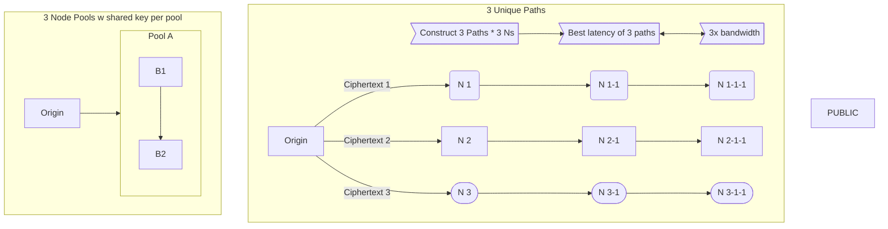

```mermaid
graph TD
    PUBLIC
    TUP

subgraph TUP[3 Unique Paths]
    y>Construct 3 Paths * 3 Ns] --> x
    x>Best latency of 3 paths] <--> z>3x bandwidth]
    A[Origin] --> |Ciphertext 1|B(N 1)
    A --> |Ciphertext 2|E[N 2]
    A --> |Ciphertext 3|H([N 3])
    B --> C(N 1-1)
    C --> D(N 1-1-1)
    E --> F[N 2-1]
    F --> G[N 2-1-1]
    H --> I([N 3-1])
    I --> J([N 3-1-1])
end

subgraph TNP[3 Node Pools w shared key per pool]
    subgraph PA[Pool A]
        B1 --> B2
    end
    A1[Origin] --> PA
end

```