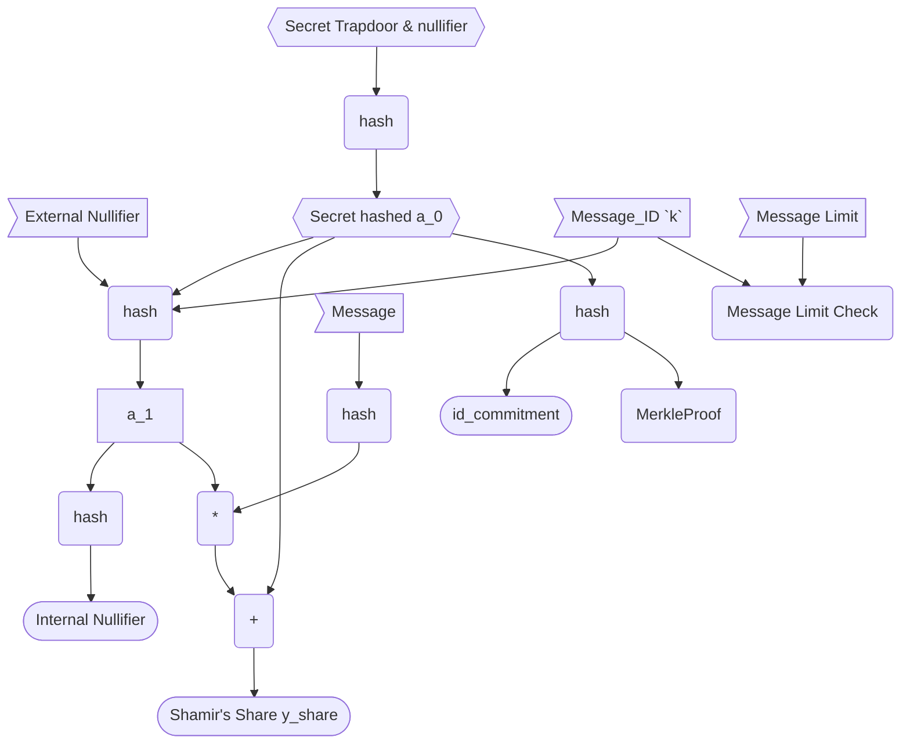

```mermaid
graph TD
    ext_null>External Nullifier] --> h1(hash)
    secret{{Secret Trapdoor & nullifier}} --> h0(hash) --> a_0
    a_0{{Secret hashed a_0}} --> h1
    msg_id>Message_ID `k`] --> h1
    msg_id --> limit_check(Message Limit Check)
    msg_limit>Message Limit] --> limit_check
    h1 --> a_1 --> h2(hash) --> int_null([Internal Nullifier])
    a_1 --> times
    m>Message] --> h3(hash) --> times(*) --> plus(+)
    a_0 --> plus --> sss([Shamir's Share y_share])
    a_0 --> h4(hash) --> id_com([id_commitment])
    h4 --> merkle(MerkleProof)

```
